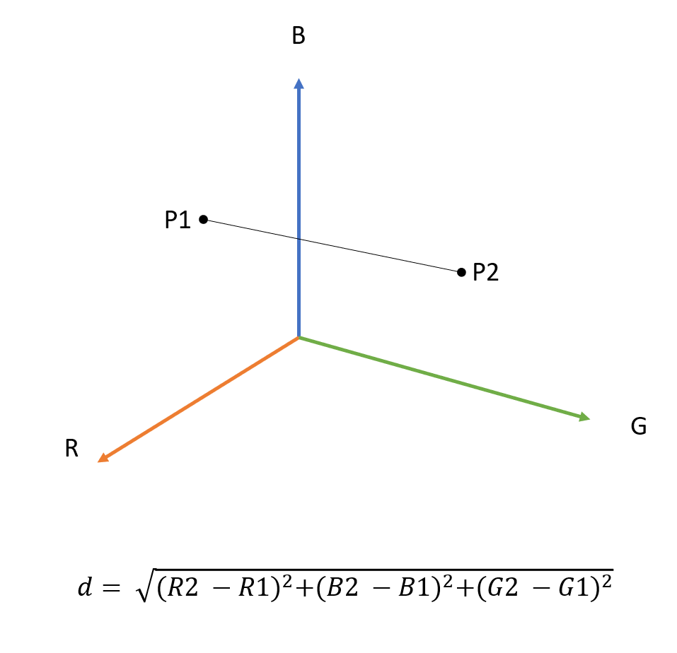

Pixel Swap
==========

This is a coding dojo / kata that looks an image manipulation. We are trying to answer the question, what would an image look like if rendered with the pixels of another? Is it possible to swap the pixels of two images and still end up with a recognizable image?

One way to think of an image is a set of pixel, organized as series of rows starting at the top left and finishing at the bottom right. An images width is the row length and it's right is the number of rows. Typically each pixel is represented by three bytes, a red, blue and green byte. The number represents the pixel's brightness, with 0 being completely turned off and 255 being completely turned on. This organization is generally referred to as a bitmap. While this format takes up a lot of space, it's often the format that developers chose to work with as it's simple and easy to understand.

If we have two bitmaps representing images that are the same size, it would be quite easy to loop over all the pixels and swap one with the other. Except this would not generate a new image, it would just move the exiting image to a new destination! To recreate our target image using the pixels of another image we need someway of looking for pixels that are in someway similar, so that we keep shapes of the initial image, but with the colours of the second image. 

One way to compare how similar two pixels are is to consider the distance between them. Pixels are represented by three values R, B, G, if we wanted to compare two pixels we could plot them on a three dimensional graph and measure the distance between them. 

The formula to calculate the distance between two points in three dimensional space is d = √ (R2 - R1) ^ 2 + (B2 - B1) ^ 2 (G2 - G1) ^ 2.

Now we have a way of comparing any two pixels, we have a simple way of achieving our pixel swap. One solution would be loop over each pixel in the first image and then search the second image for the pixel closest to it. Adopting this simple approach would work, but it would have exponential complexity, so would be very slow (especially given that images contain a large number of pixels).

To successfully complete this dojo / kata challenge it would be advantageous to come up with an algorithm that was able to efficiently find the pixels that should be swapped, this is the core challenge of the dojo / kata.

There are three stages to this challenge, of increasing difficulty, represented by three different directories of test data:
- images/Square - contains four images that are all exactly the same size, this means they have the same number of pixels and the same dimensions, which should simplify the job of swapping the pixels 
- images/Portrait-Landscape - contains two images, one images is portrait style, why the other is landscape style. The images have been size so they have the same number of pixels
- images/Misc-Sizes - contains two images of differing dimensions, and differing numbers of pixels. This means to successfully swap the images we need increase or decrease the number of pixels available from the source image by some means